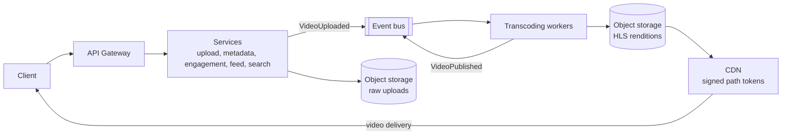

# Video Sharing Platform — Reference System Design

[](https://github.com/shivkumarsinghsky/video-streaming-platform/actions/workflows/ci.yml)


A **video sharing platform** reference system design by **Shiv Kumar**, with a runnable Python prototype of its
core flows: large resumable uploads, asynchronous transcoding, adaptive-bitrate packaging, CDN delivery with signed
URLs, view counting and engagement.

> **Reference system design inspired by publicly known product requirements** of video-sharing products. It is not
> YouTube's (or any company's) actual architecture. The repository name reflects the product category only.

## Overview

Video platforms are dominated by two costs: storing many encoded copies of every upload and delivering them to
viewers. This repository shows how the architecture follows from that: uploads go straight to object storage, a
worker fleet processes them asynchronously, and a CDN serves immutable segments. Everything around playback (counts,
feeds, search) is eventually consistent.

## Architecture



Full design, including the upload and processing sequence, capacity estimate, storage choices, data model and
trade-offs: [docs/architecture.md](docs/architecture.md).

## Key Capabilities

| Topic | Design | Prototype |
|---|---|---|
| Large file uploads | Chunked, resumable, direct-to-storage multipart | Chunk sessions with per-chunk and whole-file SHA-256, any order, idempotent retries |
| Asynchronous processing | Event-driven, one job per rendition, retries | `Pipeline` with bounded retries and idempotent resume (background task) |
| Adaptive streaming | HLS/DASH ladder capped at source resolution | HLS media and master playlists (encoder simulated) |
| CDN and access control | Immutable segments, long TTLs, signed tokens | HMAC path tokens covering one video's prefix, with expiry |
| Storage | Object storage tiers, sharded metadata | Local-directory object store with atomic writes |
| Video metadata | Strongly consistent ownership and visibility | Channel ownership enforced on completion |
| Eventual consistency | Counters, feeds, search updated asynchronously | Sharded view counters with view de-duplication |
| Engagement and discovery | Likes, subscriptions, search, recommendations | Likes, subscription feed, TF-IDF search, popularity × freshness ranking |

## Technology Stack

| Area | Prototype | Production design |
|---|---|---|
| API | Python, FastAPI | Stateless services behind an API gateway |
| Object storage | Local directory | S3-compatible object storage with lifecycle tiers |
| Processing | In-process background task, simulated encoder | Durable job queue, FFmpeg-based CPU/GPU workers |
| Delivery | Path-token route in the API | CDN with edge token validation and origin shield |
| Metadata / counters / search | In-memory | Sharded relational/NewSQL, sharded counters + stream aggregation, OpenSearch |

## Repository Structure

```text
video-streaming-platform/
├── src/video/
│   ├── storage.py      # object store, signed CDN path tokens
│   ├── uploads.py      # resumable chunked uploads with checksums
│   ├── processing.py   # bitrate ladder, transcoding pipeline, HLS playlists
│   ├── engagement.py   # sharded counters, view dedupe, likes, subscriptions, search, ranking
│   ├── api.py          # HTTP API
│   └── __main__.py     # python -m video
├── tests/              # pipeline and end-to-end API tests
├── docs/               # system design, ADRs
└── docker/  docker-compose.yml
```

## Getting Started

```bash
git clone https://github.com/shivkumarsinghsky/video-streaming-platform.git
cd video-streaming-platform
python3 -m venv .venv && source .venv/bin/activate
pip install -e ".[dev]"
pytest
python -m video --port 8000 --storage ./data      # or: docker compose up -d --build
```

Interactive API docs: <http://localhost:8000/docs>.

## Configuration

| Variable / flag | Default | Purpose |
|---|---|---|
| `CDN_SIGNING_SECRET` | `dev-only-secret` | HMAC key for CDN tokens; set your own outside local development |
| `--storage` | `./data` | Directory used as the object store |
| `--port` | `8000` | HTTP port |

## API

`X-User` stands in for the subject of a verified access token in this prototype.

| Method and path | Purpose |
|---|---|
| `POST /v1/channels` | Create a channel owned by the caller |
| `POST /v1/uploads` | Start an upload session `{filename, size, sha256}` |
| `PUT /v1/uploads/{id}/chunks/{index}` | Upload a chunk (`X-Chunk-SHA256`); idempotent |
| `GET /v1/uploads/{id}` | Missing chunks, for resumption |
| `POST /v1/uploads/{id}/complete` | Verify, create the video, start processing → `202` |
| `GET /v1/videos/{id}` | Status; signed `playbackUrl` and `thumbnailUrl` when ready |
| `POST /v1/videos/{id}/views` | Record a view (de-duplicated per viewer) |
| `PUT` / `DELETE /v1/videos/{id}/like` | Like / unlike |
| `POST /v1/channels/{id}/subscribe` | Subscribe |
| `GET /v1/feed/subscriptions`, `/v1/search?q=`, `/v1/recommendations` | Discovery |
| `GET /cdn/t/{expires}/{sig}/{key}` | Stand-in for the CDN edge: validates the token, serves the object |

## Testing

```bash
pytest                 # 9 tests
ruff check . && mypy
```

The tests cover:

- out-of-order and retried chunks, and checksum mismatches;
- a ladder that never upscales;
- transient transcoding failures with retries, and idempotent resume after hitting the retry limit;
- signed URLs limited to one video prefix, plus expiry;
- sharded counters, view de-duplication, likes, search and ranking;
- the full flow over HTTP: upload → processing → playback of the master playlist and a segment through the token
  route;
- validation and ownership errors.

## Docker

`docker/Dockerfile` runs the API as a non-root user; `docker-compose.yml` mounts a volume as the object store.

## Architecture Decisions

| ADR | Decision |
|---|---|
| [ADR-001](docs/decisions/ADR-001-resumable-direct-to-storage-uploads.md) | Resumable, chunked uploads directly to object storage |
| [ADR-002](docs/decisions/ADR-002-idempotent-per-rendition-transcoding.md) | Asynchronous, idempotent transcoding jobs per rendition |
| [ADR-003](docs/decisions/ADR-003-abr-streaming-with-cdn-path-tokens.md) | HLS adaptive streaming via CDN with signed path tokens |
| [ADR-004](docs/decisions/ADR-004-sharded-counters-eventual-consistency.md) | Sharded view counters with eventual consistency |

## Scalability Considerations

- Egress is served by the CDN; immutable segments give high hit ratios, and an origin shield protects storage.
- The transcoding fleet scales on queue depth and can use spot capacity, because jobs are idempotent.
- Upload bytes bypass API servers via pre-signed multipart URLs.
- Metadata is sharded by `video_id`; comments are partitioned by `video_id`.
- Counters are sharded and aggregated from a stream.

## Reliability

- Resumable uploads with checksum verification.
- Retried, idempotent processing jobs; a rendition counts as complete only once its playlist exists.
- Failed videos are visible to creators.
- CDN failover.
- Eventual consistency only where users tolerate it.

## Security

- Authenticated uploads with an ownership check.
- Expiring HMAC CDN tokens for private and unlisted videos; the secret is supplied via the environment.
- Sandboxed processing of untrusted media.
- Moderation pipeline.
- Rate limits and view de-duplication.

## Observability

Playback quality of experience (startup time, rebuffering, errors by CDN/region/device), time to first playable
rendition, pipeline failure rate, queue depth, CDN hit ratio and origin egress, upload resumption rate.

## Future Improvements

Not implemented in the prototype:

- Real FFmpeg transcoding (the encoder is simulated).
- S3 pre-signed multipart uploads.
- A durable job queue and worker fleet.
- Persistent metadata store.
- OpenSearch indexing.
- Comments.
- DASH and DRM.
- Thumbnail extraction from real frames.

## Related Projects

- [System Design Architecture](https://github.com/shivkumarsinghsky/system-design-architecture) — [video sharing design](https://github.com/shivkumarsinghsky/system-design-architecture/blob/main/docs/designs/01-video-sharing-platform.md) and capacity model (`video-sharing` scenario)
- [Event-Driven Platform](https://github.com/shivkumarsinghsky/event-driven-platform) — outbox, retries, idempotent consumers
- [Microservices Patterns](https://github.com/shivkumarsinghsky/microservices-patterns) — resilience and idempotency patterns
- [Social Media Platform](https://github.com/shivkumarsinghsky/social-media-platform) — feeds, fan-out and notifications
- [Real-Time Monitoring Platform](https://github.com/shivkumarsinghsky/realtime-monitoring-platform) — streaming ingestion and metrics

## Author

**Shiv Kumar** — Senior Software Engineer / Software Architect
GitHub: [github.com/shivkumarsinghsky](https://github.com/shivkumarsinghsky)

## License

[MIT](LICENSE)
