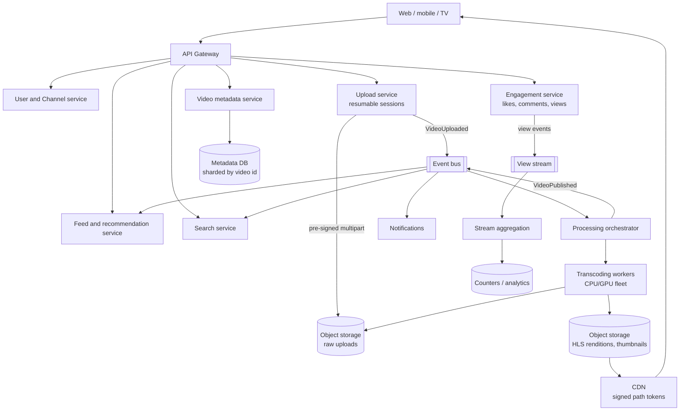
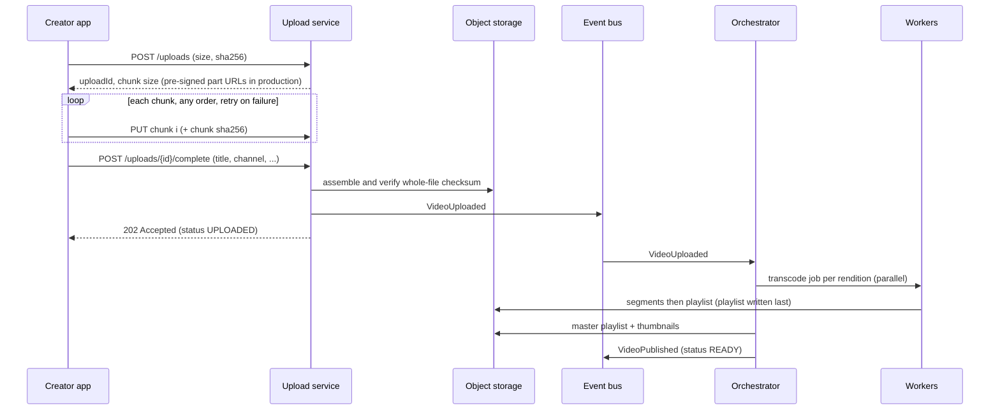
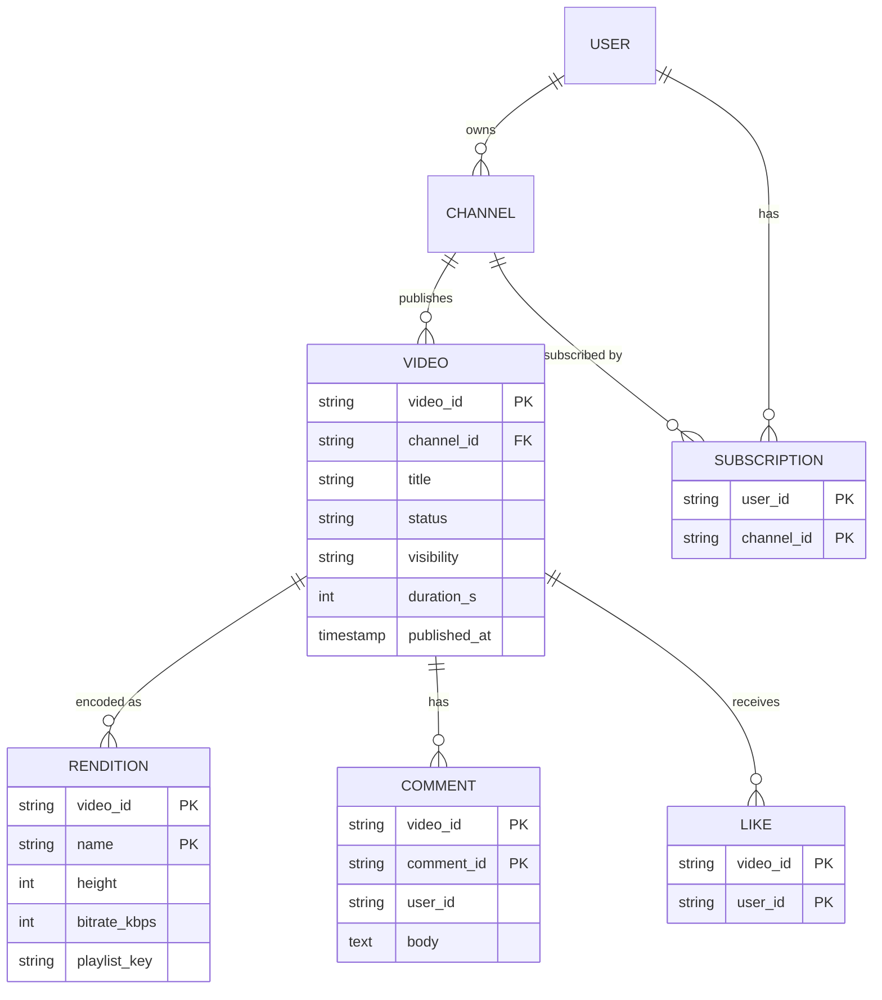

# Video Sharing Platform — Reference System Design

> Reference system design inspired by publicly known product requirements of video-sharing products.
> It is not a description of YouTube's (or any company's) internal architecture; numbers are illustrative.

**Author:** Shiv Kumar · [GitHub](https://github.com/shivkumarsinghsky)

## Requirements

### Functional

- Users and channels; subscriptions.
- Upload long videos (up to 10 GB) reliably, including from mobile networks.
- Transcode into an adaptive-bitrate ladder, generate thumbnails, package for streaming (HLS/DASH).
- Stream with adaptive bitrate and seeking, worldwide.
- Search; home and subscription feeds; recommendations.
- Comments, likes, view counts; notifications to subscribers; creator analytics.

### Non-functional

| Concern | Target |
|---|---|
| Playback start | < 2 s p95; rebuffering ratio < 1% |
| Upload reliability | Resumable; no data loss after the upload is acknowledged |
| Availability | 99.95% playback, 99.9% upload |
| Processing time | Lowest rendition playable within minutes; full ladder later |
| Consistency | Eventual for counts, feeds and search; strong for ownership and privacy settings |
| Scale (assumption) | 50M DAU, 500K uploads/day, 500M views/day |

## Capacity Estimation

| Metric | Estimate |
|---|---|
| Uploads/day | 50M × 1% = 500K; ~6/s average |
| Stored per upload (source + renditions) | ~300 MB |
| Views/day | 50M × 10 = 500M; ~5.8K/s average, ~17K/s peak |
| Egress | ~50 MB delivered per view (partial watch, adaptive bitrate) → ~2.3 Tbps average, ~6.9 Tbps peak — served by the CDN, not origin |
| Storage growth | ~150 TB/day; ~820 PB over 5 years at replication factor 3 → tiering and erasure coding matter |
| Metadata reads | Dominated by watch pages, feeds and search; heavily cached |

Derived with the capacity model in [system-design-architecture](https://github.com/shivkumarsinghsky/system-design-architecture)
(`python -m capacity video-sharing`). The conclusion drives the architecture: **egress and storage dominate cost;
the CDN and storage tiering are the most important design choices.**

## High-Level Architecture



### Upload and processing flow



## Large File Uploads

- **Chunked, resumable** sessions: fixed-size chunks with per-chunk checksums, uploaded in any order, retried
  individually; `GET /uploads/{id}` returns missing chunks for resumption.
- **Direct to object storage**: in production the upload service only issues pre-signed multipart URLs; bytes never
  pass through API servers ([ADR-001](decisions/ADR-001-resumable-direct-to-storage-uploads.md)).
- Whole-file checksum verified before processing; incomplete sessions expire and their parts are garbage-collected.

## Asynchronous Processing

- Event-driven orchestration; one job per (video, rendition) so renditions run in parallel on a worker fleet and a
  failure retries only that rendition ([ADR-002](decisions/ADR-002-idempotent-per-rendition-transcoding.md)).
- Idempotency: a rendition is complete only when its playlist exists (written after all segments), so redelivered
  jobs skip finished work.
- Prioritisation: the lowest rendition first so a video becomes playable quickly; higher renditions follow.
- Ladder capped at source resolution; per-title encoding (choosing bitrates by content complexity) is a known
  optimisation.

## CDN and Streaming

- Adaptive bitrate (HLS/DASH): a master playlist lists renditions; players switch renditions per segment based on
  measured bandwidth.
- Segments are immutable → long cache lifetimes at the CDN (`max-age=1y`), very high hit ratios for popular content.
- Access control for unlisted/private content uses **signed path tokens** that cover the video's prefix, so relative
  segment fetches stay authorised ([ADR-003](decisions/ADR-003-abr-streaming-with-cdn-path-tokens.md)).
- Origin shield between CDN and storage reduces origin load during viral spikes.

## Storage

| Data | Store | Notes |
|---|---|---|
| Raw uploads | Object storage | Moved to cold/archive tier after processing |
| Renditions, thumbnails | Object storage + CDN | Hot for popular, infrequent-access tier for the long tail |
| Video metadata | Sharded relational/NewSQL by `video_id` | Strong consistency for ownership and visibility |
| Comments | Wide-column, partitioned by `video_id` | Append-heavy, paginated by time |
| Counters | Sharded counters + stream aggregation | Eventually consistent |
| Search | Inverted index (Elasticsearch/OpenSearch) | Fed by `VideoPublished` / `VideoUpdated` events |

## API Design

```http
POST /v1/uploads                                   { filename, size, sha256 } → { uploadId, chunkSize, totalChunks }
PUT  /v1/uploads/{id}/chunks/{index}               X-Chunk-SHA256 (idempotent)
GET  /v1/uploads/{id}                              → { missingChunks }
POST /v1/uploads/{id}/complete                     { channel_id, title, tags, ... } → 202
GET  /v1/videos/{id}                               → status, renditions, signed playbackUrl
POST /v1/videos/{id}/views    PUT|DELETE /v1/videos/{id}/like
POST /v1/channels/{id}/subscribe    GET /v1/feed/subscriptions    GET /v1/search?q=    GET /v1/recommendations
```

## Data Model



## Caching

- CDN for media (immutable segments, long TTL) and thumbnails.
- Watch-page metadata and channel pages in a distributed cache with event-driven invalidation.
- Precomputed recommendation candidate lists per user segment; subscription feeds cached briefly.

## Messaging

`VideoUploaded`, `RenditionCompleted`, `VideoPublished`, `VideoUpdated`, `VideoDeleted`, view events. Consumers:
processing, search indexing, feed fan-out, notifications, analytics. All consumers are idempotent by event id.

## Scaling

- Upload, metadata and engagement services are stateless behind load balancers.
- Transcoding fleet autoscaled on queue depth; spot/preemptible capacity is acceptable because jobs are idempotent.
- View counting through sharded counters and a stream aggregator
  ([ADR-004](decisions/ADR-004-sharded-counters-eventual-consistency.md)).
- Metadata sharded by `video_id`; comments partitioned by `video_id`.

## Reliability

- Resumable uploads; checksum verification; retried, idempotent processing jobs; failed videos visible to creators
  with a retry option.
- Multi-CDN or CDN failover for playback; origin shielding.
- Eventual consistency is acceptable for counts, feeds and search; ownership and visibility changes are strongly
  consistent and propagate to the CDN via token expiry and purges.

## Security

- Authentication for uploads and engagement; channel ownership checked on upload completion.
- Signed, expiring CDN tokens for private/unlisted videos; HMAC verified at the edge.
- Malware/format validation of uploads in an isolated processing sandbox; content moderation pipeline (automated
  classifiers + human review) before or shortly after publication.
- Rate limits on uploads, comments, likes and views; view de-duplication against inflation.

## Observability

- Playback QoE from clients: startup time, rebuffering ratio, bitrate switches, errors (by CDN, region, device).
- Pipeline: queue depth, time to first playable rendition, failure rate per rendition.
- CDN hit ratio and origin egress; upload resumption rate.

## Trade-offs

| Decision | Benefit | Cost |
|---|---|---|
| Direct-to-storage chunked uploads | Reliable, no API bandwidth | More complex client protocol |
| Per-rendition jobs | Parallelism, fine-grained retries | More orchestration state |
| HLS segments + CDN | Scales egress globally, ABR | Startup latency vs. segment length trade-off |
| Eventually consistent counters | Absorbs viral write spikes | Counts lag by seconds/minutes |
| Search via events | Decoupled indexing | New videos searchable after a short delay |
